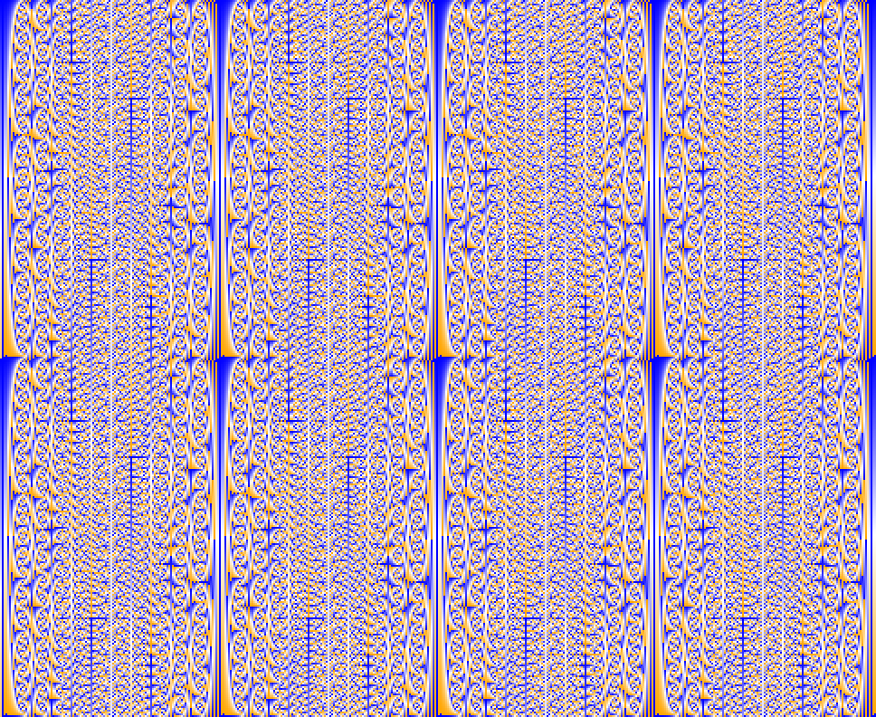

# Fibonacci Weave

This is a phenomena that has been on my mind for years, after spending time in class messing around with numbers instead of actually paying attention. This is a combination of a few ideas I was messing around with at the time, mainly Fibonacci numbers, and the modulus.

If we start with the normal Fibonacci sequence, we'd have
```
0 1 1 2 3 5 8 13 21 34 ...
```

But if we modulate it by a given number (for example, 11), we'd get
```
0 1 1 2 3 5 8 2 10 1 0 1 1 ...
```

The interesting thing here being that it repeats.

Building on top of this, if we were to add rows where we simply increment the first digit and keep the rest the same, that would look something like this
```
 0  1  1  2  3  5  8  2 10  1  0  1 ...
 1  1  2  3  5  8  2 10  1  0  1  1 ...
 2  1  3  4  7  0  7  7  3 10  2  1 ...
 3  1  4  5  9  3  1  4  5  9  3  1 ...
 ...
```

This is a python script for generating these images as using spreadsheet programs was starting to get very slow. Even though they serve no practical purpose (at this time), I still think they at least look interesting. This script generates these "Fibonacci Weaves" with a given divisor and image size/scale, and adds colors for the min/max values to help visualize the data.

Here are the command line arguments (and default values). The positions of the values are hard-set, so to set the image size, you'll also need to set the divisor and scale.
```
./fibweave [divisor: 99] [scale factor: 8] [image width: 3840] [image height: 2160]
```

Requires `numpy` and `PIL`.

Here's the image generated with the default values


